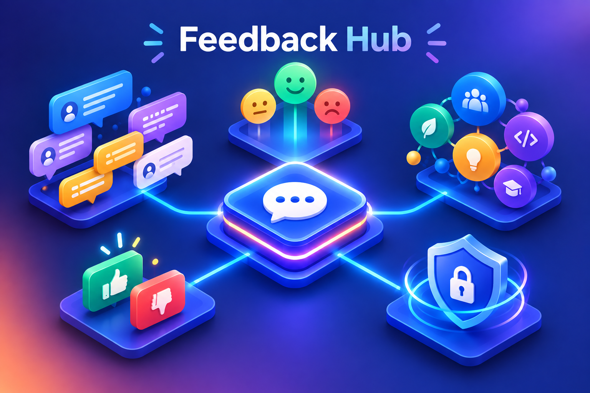

# FeedbackHub

[](https://github.com/sivaprasadreddy/feedback-hub/actions/workflows/ci.yml)
[](https://sonarcloud.io/summary/new_code?id=sivaprasadreddy_feedback-hub)
[](https://sonarcloud.io/summary/new_code?id=sivaprasadreddy_feedback-hub)

A feedback management platform where an organization can provide their employees with a private space to:

* Express feedback, opinions, suggestions, concerns, or ideas.
* Participate in discussions through replies.
* Post or reply using their identity or anonymously.
* Upvote/downvote messages and replies.
* Discover popular and recent discussions.
* Understand the tone of each message through AI-powered sentiment analysis.
* Organize messages with relevant topics identified automatically by AI.
* Keep discussions clean by detecting potentially spammy replies.
* Allow administrators to moderate users, messages, and replies.



## Tech Stack

* **Backend:** Java, Spring Boot, Spring MVC, Bean Validation, and Spring Boot Actuator
* **Architecture:** Spring Modulith
* **AI:** Spring AI with Ollama and OpenAI
* **Security:** Spring Security and Thymeleaf Spring Security integration
* **Data:** Spring Data JPA, Hibernate, PostgreSQL, and Flyway
* **Email:** Spring Mail and Mailpit
* **Frontend:** Thymeleaf, Thymeleaf Layout Dialect, HTMX, Tailwind CSS 4, Font Awesome, and WebJars
* **Developer tooling:** Spring Boot DevTools, Docker Compose, BootUI, Maven, and Spotless
* **Testing:** JUnit 5, Spring Boot Test, Spring Modulith Test, Testcontainers, Awaitility, ArchUnit, Taikai, and Spring Test Profiler
* **Code quality:** JaCoCo and SonarQube

## Prerequisites
* JDK 25
* Docker and Docker Compose
* [Ollama](https://ollama.com/) with [gemma3:270m](https://ollama.com/library/gemma3) model
* Your favourite IDE (Recommended: [IntelliJ IDEA](https://www.jetbrains.com/idea/))

Follow the [Installation Guide](docs/installation.md) to install the required tools.

Verify the prerequisites:

```shell
$ java -version
$ docker info
$ docker compose version
$ task --version
$ ollama --version
```

## How to run?

```shell
# runs all tests
$ task test 

# formats java code using spotless
$ task format

# builds docker image
$ task build_image 

# starts app using docker compose
$ task start 
$ task stop
$ task restart
```

**NOTE:** For development, keep the watcher running in a separate terminal: `npm run css:watch`

* Application URL: http://localhost:8080
* Credentials: `admin@gmail.com/secret`, `siva@gmail.com/secret`

## Deploying on k8s cluster

Set up a Kind cluster following [Installation Guide](docs/installation.md)

```shell
# create kind cluster 
$ task kind_create

# deploy app to kind cluster 
$ task k8s_deploy  // this will take a while to download ollama

# undeploy app
$ task k8s_undeploy

# destroy kind cluster 
$ task kind_destroy
```

Application URL: http://localhost:80

## AI Model Setup

FeedbackHub uses Spring AI and supports both Ollama and OpenAI as chat model providers. Ollama is the default provider.
The provider and model can be selected through environment variables when starting the application. 

To use Ollama:

```shell
$ AI_PROVIDER=ollama OLLAMA_MODEL=gemma3:270m ./mvnw spring-boot:run
```

To use OpenAI, provide an API key and optionally choose a model:

```shell
$ AI_PROVIDER=openai OPENAI_API_KEY=<your-api-key> OPENAI_MODEL=gpt-5 ./mvnw spring-boot:run
```

These environment variables map to the Spring AI settings in [`src/main/resources/application.properties`](src/main/resources/application.properties). 

`OLLAMA_URL` can also be set when Ollama is running somewhere other than `http://localhost:11434`.

To try a different Ollama model locally, pull it first and pass its name through `OLLAMA_MODEL`:

```shell
$ ollama pull <model-name>
$ AI_PROVIDER=ollama OLLAMA_MODEL=<model-name> ./mvnw spring-boot:run
```

Using an environment variable requires no source-file changes. To make another Ollama model the project default, update every place that declares or prepares the default model:

* [`src/main/resources/application.properties`](src/main/resources/application.properties) for the application default.
* [`docker/compose.yml`](docker/compose.yml) and [`docker/ollama-entrypoint.sh`](docker/ollama-entrypoint.sh) for Docker Compose.
* [`k8s/manifests/config.yaml`](k8s/manifests/config.yaml) for Kubernetes.
* This README and [`docs/installation.md`](docs/installation.md) to keep the setup instructions current.

## Using Agent Skills

This repository includes project-specific Agent Skills in [`.agents/skills`](.agents/skills). 

```text
Use $prd-to-requirements to generate docs/requirements.md from docs/prd.md.
Use $implement-usecase to implement UC-001.
Use $update-usecase to update UC-001 from the current implementation.
Use $java-code-review to review the modified Java files.
```

| Skill                  | Purpose                                                                       |
|------------------------|-------------------------------------------------------------------------------|
| `$prd-to-requirements` | Generate or regenerate use-case requirements from the PRD.                    |
| `$implement-usecase`   | Implement and test one `UC-###`, updating its status during the workflow.     |
| `$update-usecase`      | Synchronize one use case with behavior already present in the code and tests. |
| `$java-code-review`    | Review Java changes and create an actionable `review.md` report.              |

You may want to install additional skills from [sivalabs-agent-skills](https://github.com/sivaprasadreddy/sivalabs-agent-skills).
